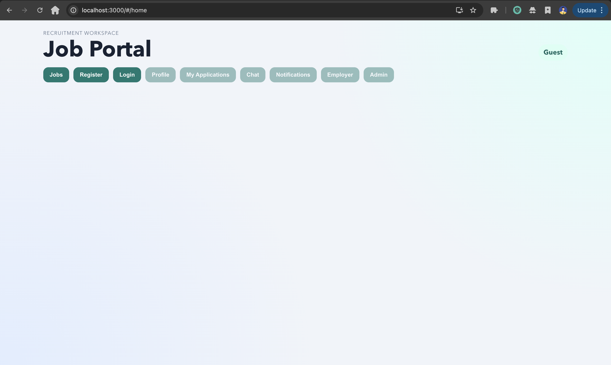
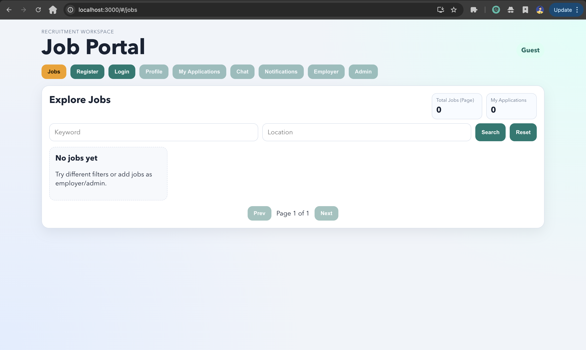
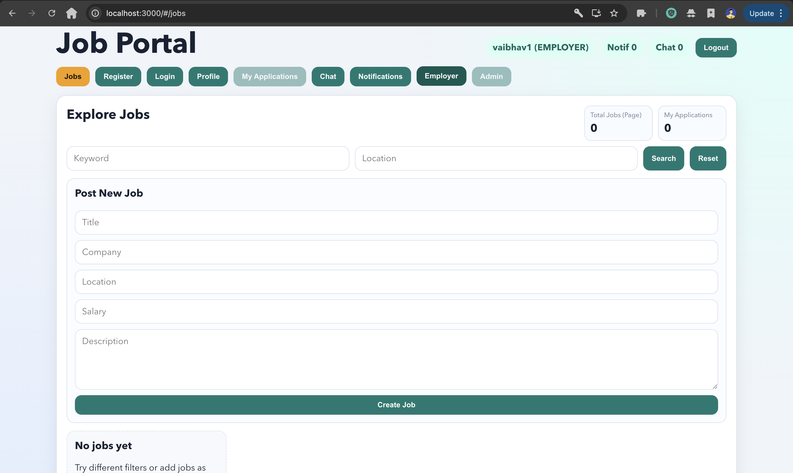
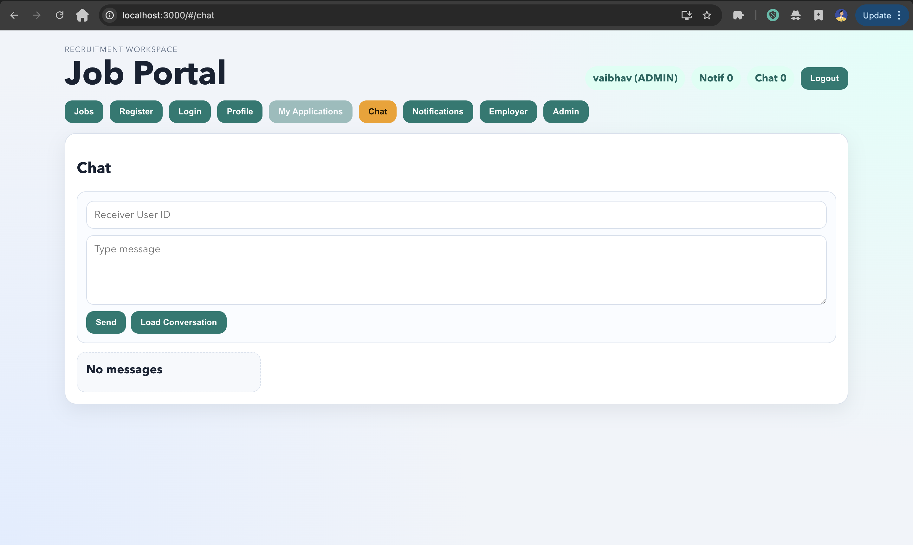

# Job Portal

Full-stack job portal with Spring Boot backend and React frontend.

## Features

- JWT auth with refresh token flow
- Email verification and password reset flow
- Role-based access (`CANDIDATE`, `EMPLOYER`, `ADMIN`)
- Jobs CRUD with search and pagination
- Applications with ATS scoring
- Employer pipeline and analytics dashboard
- Interview scheduling and feedback
- In-app notifications and chat APIs
- Swagger docs, Prometheus metrics, Grafana support

## Tech Stack

- Backend: Java 17, Spring Boot 4, Spring Security, JPA, MySQL
- Frontend: React (CRA)
- Monitoring: Actuator + Prometheus + Grafana
- Containerization: Docker + Compose

## Project Structure

- `job-portal-backend/`
- `job-portal-frontend/`
- `monitoring/`
- `docker-compose.yml`

## Local Run (without Docker)

### 1) Backend

```bash
cd /Users/vaibhavsuryawanshi/job-portal/job-portal-backend
cp .env.example .env
./mvnw spring-boot:run
```

Backend URLs:
- API base: `http://localhost:9090/api/v1`
- Swagger: `http://localhost:9090/swagger-ui.html`
- Health: `http://localhost:9090/actuator/health`
- Prometheus metrics: `http://localhost:9090/actuator/prometheus`

### 2) Frontend

```bash
cd /Users/vaibhavsuryawanshi/job-portal/job-portal-frontend
cp .env.example .env
npm install
npm start
```

Frontend URL:
- `http://localhost:3000`

## Run with Docker

```bash
cd /Users/vaibhavsuryawanshi/job-portal
cp .env.example .env
docker compose up --build
```

URLs:
- Frontend: `http://localhost:3000`
- Backend: `http://localhost:9090`
- Prometheus: `http://localhost:9091`
- Grafana: `http://localhost:3001` (`admin` / `admin`)

## Screenshots

Add screenshots under `docs/screenshots/` and keep these names:

- `docs/screenshots/home.png`
- `docs/screenshots/jobs.png`
- `docs/screenshots/employer-pipeline.png`
- `docs/screenshots/admin-dashboard.png`
- `docs/screenshots/chat-notifications.png`

Markdown preview examples:







## CI

GitHub Actions workflow runs on push/PR:
- Backend: `./mvnw -q verify`
- Frontend: `npm test` and `npm run build`

Workflow file:
- `.github/workflows/ci.yml`
